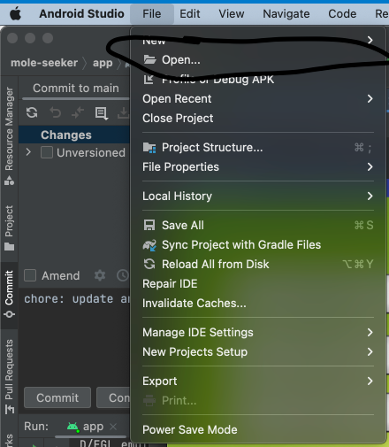
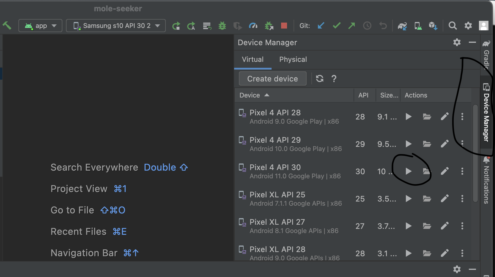
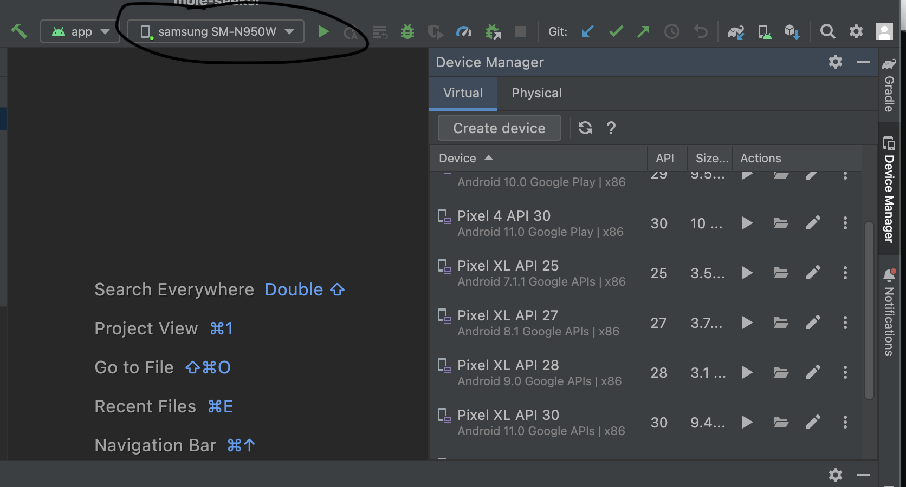

# Mole Seeker

A simple Android game demonstrating an implementation of the Singleton pattern design

## Requirements

* Android Studio Electric Eel or newer

## Usage

1. Clone the repo

```
git clone https://github.com/ksg604/mole-seeker.git
``` 

2. Run Android Studio and open the folder you just cloned 



3. Select Build -> Make Project

4. Open the device manager on the right hand side of Android Studio



5. Choose one of the emulator devices to run the app by clicking the play button next to one of them

6. Select Run -> Run app on Android Studio

The app should run on the virtual device you have running.  

If you don't want to use an emulator, you can plug in a physical Android device to test Mole Seeker out.  If you are doing this, ensure USB debugging is enabled on your device.  Then, plug your device in while Android studio has the Mole Seeker project opened.  Ensure your device is selected to run the app and then choose Run -> Run app.



Mole Seeker should then be installed and run automatically on your device